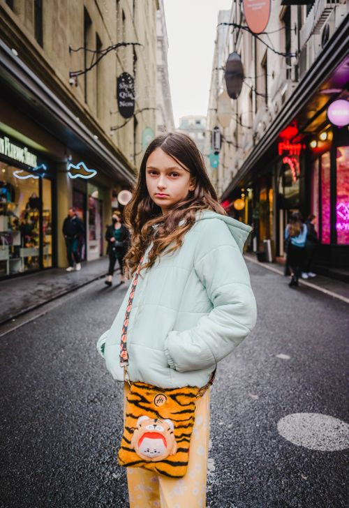
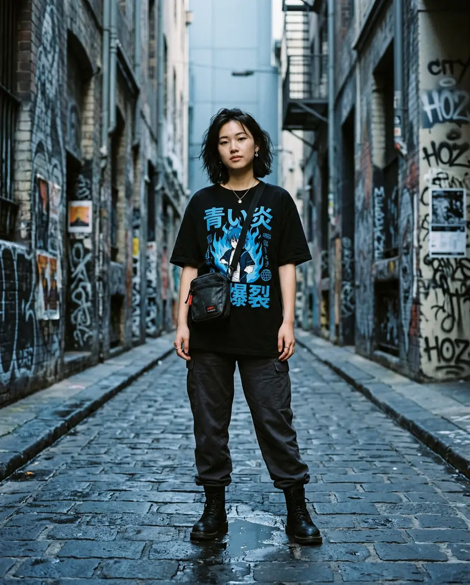
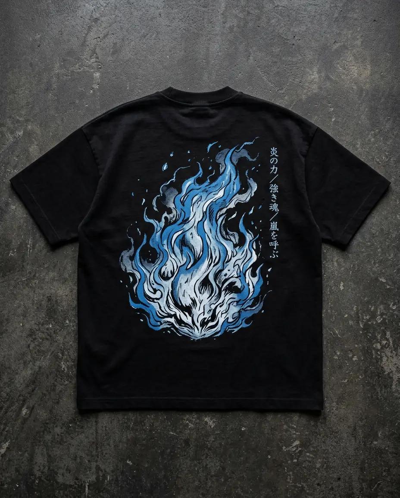
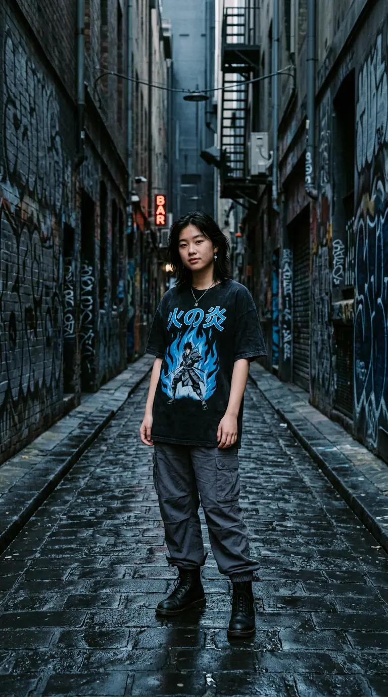
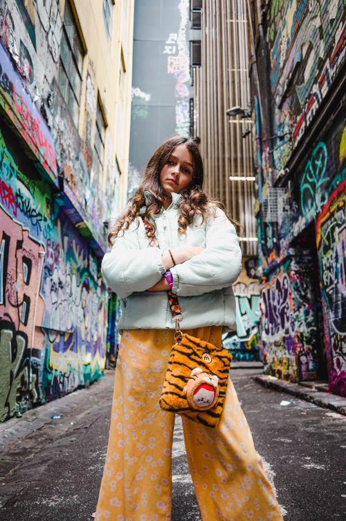

# ZENJI — user manual

Everything the storefront can do, in the order a real customer runs into it. Written for anyone:
a reviewer, a new developer, or the person who ends up running the shop.

**Live site:** https://fozayelibnayaz.github.io/ZENJI-Anime-Streetwear-Australia/

Reference imagery: Pexels (free licence) — the audience this store is built for: inner-Melbourne, 16–28, phone first.

---

## Contents

1. [Getting around](#1-getting-around)
2. [The hero — cut the garment open](#2-the-hero--cut-the-garment-open)
3. [Browsing the drop](#3-browsing-the-drop)
4. [Quick view](#4-quick-view)
5. [The product page](#5-the-product-page)
6. [Fit Lab — find your size](#6-fit-lab--find-your-size)
7. [The Closet — the digital fitting room](#7-the-closet--the-digital-fitting-room)
8. [Your loadout (the cart)](#8-your-loadout-the-cart)
9. [The SYSTEM console](#9-the-system-console)
10. [Drop Day](#10-drop-day)
11. [Lookbook](#11-lookbook)
12. [Origin](#12-origin)
13. [Support](#13-support)
14. [Accessibility and preferences](#14-accessibility-and-preferences)
15. [On a phone](#15-on-a-phone)
16. [Troubleshooting](#16-troubleshooting)

---

## 1. Getting around

The header is fixed to the top of every page and holds five things:

| Control | What it does |
|---|---|
| **ZENJI** wordmark | Home |
| Nav links | Drop, Lookbook, Drop Day, Fit Lab, Closet, Origin, Support. The current section is underlined in red |
| **Search** (`⌘K`) | Opens the SYSTEM console — see [section 9](#9-the-system-console) |
| **Loadout** | Opens the cart drawer; the number beside it is your item count |
| **≡** | Mobile only — full-screen menu |

Above the header, a ticker runs live announcements (new drops, free shipping threshold). It is
decorative for sighted users and read once by screen readers.

---

## 2. The hero — cut the garment open

The homepage opens on a garment with a katana cut running through it. **Drag the cut left and right**
and the back print is revealed underneath.

Left: what you see before the cut. Right: what is revealed behind it.

| Input | Behaviour |
|---|---|
| Mouse | The cut follows the pointer as soon as it enters the image — no click required |
| Touch | Press and drag. A plain vertical swipe still scrolls the page |
| Keyboard | Tab to the handle, then `←` / `→` to move it, `Home` / `End` to slam it to either edge |
| Nothing at all | The cut breathes slowly by itself until you touch it, then stops for good |

The readout in the bottom right shows the reveal percentage once you take over. If you have reduced
motion enabled, the idle animation never starts — the cut still works, it just waits for you.

---

## 3. Browsing the drop

**Drop** is the full catalogue. The filter bar sticks to the top of the list while you scroll:

- **Type** — Tees, Hoodies, Pants, Headwear (multi-select)
- **Size** — XS to 2XL. Filtering by size shows only pieces with that size *actually in stock*
- **Show** — In stock, On sale
- **Sort** — Featured, Newest, Price ascending, Price descending

Everything you pick is written into the URL. That means:

- the browser **back button** steps back through your filters,
- a filtered view can be **shared or bookmarked** (`/drop?category=hoodie&size=L`),
- the Fit Lab can link you straight to `/drop?size=L`.

The counter above the grid announces the result count to screen readers as it changes. If a
combination has no results you get an explanation and a one-tap reset, never an empty screen.

**On each card:** sale badge, low-stock warning ("Low: XS · 2XL"), a green flag when your Fit Lab
size is in stock, and a ☆ button to save the piece. Hovering (or tabbing to) a card swaps the photo
to the back print and slides up a **Quick view** button.

---

## 4. Quick view

Quick view is a modal, not a page — you keep your place in the grid.

It shows the garment, the price, the one-line hook, the size selector and add-to-loadout. Your Fit
Lab size is preselected and marked with a small green corner. Sold-out sizes are struck through and
cannot be picked.

Press `Esc`, click the backdrop, or use the ✕ to close. Focus returns to the card you opened it from.

---

## 5. The product page

Top half: gallery on the left (thumbnails on desktop, a swipeable track on mobile), buy panel on the
right. The buy panel sticks while you read.

Below the buy button, four expandable sections:

- **The story** — what the graphic means and how it was printed
- **Fabric & care** — composition and the three rules that keep the print alive
- **Measurements** — the full chart, in centimetres, taken off the actual pattern
- **Shipping & returns** — delivery windows and cost for your part of Australia

Stock messaging is honest: "Only 2 left in S", "8 in stock · ships from Fitzroy", or "Sold out — no
restock". Structured data (`schema.org/Product`) is emitted for every piece, so Google shows the
price and availability correctly.

At the bottom: the rest of the chapter, so you never hit a dead end.

---

## 6. Fit Lab — find your size

The single most useful thing on the site. Oversized means something different at every label, so
instead of describing our fit we compare it to a garment you already own.

**Three steps:**

1. **Choose the garment type** — Tees or Hoodies.
2. **Pick a reference.** Either select something from the list ("Standard AU size M tee",
   "Uniqlo U size M", "Oversized boxy tee (M)") or measure your own: lay it flat, measure
   armpit-to-armpit for chest and shoulder-to-hem for length. Use the sliders or type the numbers.
   Switch between **cm and inches** at any time.
3. **Say how you want it to sit** — Close, True to ZENJI, or Extra boxy.

**What you get back, instantly:**

- Your size, in 96pt type, with a confidence rating.
- An overlay drawing: your garment (dashed grey) against the ZENJI pattern (red hatch), to scale.
- A **boxiness meter** — how square the recommendation is compared to your reference.
- A plain-language summary: *"Size L lands 3.0cm wider across the chest and 1.0cm longer in the
  body than the garment you measured, so it will read boxier than your reference."*
- Every size ranked, with the exact centimetre difference and a match bar.

Press **Save my size** and it is remembered on your device. From then on the size is preselected on
every product page and quick view, and the collection grid flags pieces where your size is in stock.

> Nothing leaves your browser. There is no backend in this build — the measurements live in
> `localStorage` and nowhere else.

**Video reference — how to measure a garment flat:**
[Pexels: clothing on hangers and racks](https://www.pexels.com/video/display-clothes-on-a-rack-8177624/) ·
[Pexels: browsing a boutique rail](https://www.pexels.com/video/woman-shopping-for-clothes-7680438/)
(free licence stock footage of the shopping behaviour this tool is designed to replace).

---

## 7. The Closet — the digital fitting room

The whole reason a site like this usually gets returns is that you cannot try a boxy tee before
buying it. The Closet fixes that without a backend: a wireframe figure that dresses in real time.

**One figure, three tools** (switch with the tabs at the top):

**Try on** — the core. Three steps: pick a category (Tees, Hoodies, Pants, Headwear), pick a piece,
then pick a size. The garment renders *on* the figure, and because it is scaled from the actual size
chart, choosing **S vs 2XL genuinely changes how the garment hangs**. The live readout shows the flat
chest and length in centimetres.

**Stack a look** — build a full outfit one slot at a time (tee → hoodie → cargo → cap). The figure
wears everything you select, and a running total tracks the price. When the look is right, **Add look
to loadout** drops every piece into your cart in one tap.

**Weather the drop** — Melbourne weather decides. Pick a scenario (the 11° drizzle, the 32° scorcher,
the 2am tram home) and the stylist recommends a full look from real stock, with the reasoning in plain
English. Swap sizes per piece, then add the whole look.

**Try it before you buy it** from the homepage, too — the teaser embeds the real dress figure, not a
screenshot. Frames (Athletic / Classic / Boxy) and presentations (F / M / U) nudge the figure's
proportions so it reads differently, but the garment itself is always sized by your chosen product
size, not the model's.

The lookbook work the Closet's editorial scene is built around.

---

## 8. Your loadout (the cart)

Called the loadout because that is what the customer calls it.

- Opens as a drawer from the right; the page behind it locks but does not jump.
- A progress bar shows how far you are from **free Australia-wide shipping over A$100**.
- Quantity steppers respect real stock — you cannot add an eleventh unit of a size with ten left.
- Removing a line raises an **Undo** toast for five seconds.
- The contents survive a refresh, a new tab, and closing the browser.

Checkout is intentionally inert in this build and says so when pressed.

---

## 9. The SYSTEM console

Press **⌘K** (macOS) or **Ctrl+K** (Windows/Linux) anywhere. `/` also opens it when you are not
typing in a field. On touch devices, use the **Search** button in the header.

One input, three groups of results:

- **Products** — live catalogue search across name, romaji, colourway and category, with thumbnails
- **Pages** — jump to any section
- **Controls** — open the loadout, open the size guide, recalculate your fit, switch cm/inches,
  reduce animation

`↑` `↓` move, `Enter` runs, `Esc` closes. Hovering also moves the selection, so mouse and keyboard
never disagree about what is selected.

---

## 10. Drop Day

Drops land **fortnightly, Friday 7:00pm AEST**. The console has four panels:

1. **Countdown** — days, hours, minutes, seconds, plus the drop time written out both in Melbourne
   time and in *your* timezone, named after your city. No mental AEST arithmetic in Perth.
2. **Release queue** — join it and watch your position fall in uneven bursts, with a live ETA. If
   you hold an early-access pass you start near the front.
3. **The seal test** — match four kanji to their meanings inside 20 seconds. A wrong answer costs
   three seconds. Clear it and the early-access pass is stored on your device permanently.
4. **Live stock board** — remaining units and current viewers for the featured pieces, ticking in
   real time. Labelled honestly as a simulated feed.

---

## 11. Lookbook

Three looks shot around inner Melbourne. Every photo carries **shoppable pins**: tap the `+` and the
quick view opens on that exact piece. Under each photo the same items are listed as buttons, so the
lookbook is fully usable by keyboard and screen reader without hunting for hotspots.

Location reference: Pexels (free licence).

---

## 12. Origin

The brand story told as a vertical manga. Panels ink in as they enter the viewport, a chapter rail
tracks your position, and speed lines intensify with how fast you scroll.

Turn animation off (console → *Reduce animation*, or your OS reduced-motion setting) and it becomes
a clean, quiet article with all the same words. The story is content first.

---

## 13. Support

- **Delivery table** — every Australian zone with speed and cost, plus New Zealand.
- **FAQ** — filter by topic (Sizing, Shipping, Returns, Drops, Care) or search the text. Built on
  native `
`, so it works before JavaScript loads.
- **Contact form** — real validation: it tells you which field is wrong, moves focus there, and
  never silently swallows a submission. It states plainly that this build sends nothing.

---

## 14. Accessibility and preferences

| | |
|---|---|
| **Keyboard** | Every interactive element is reachable and visibly focused. Overlays trap focus and return it on close |
| **Screen readers** | Landmarks, one `h1` per page, labelled controls, live regions for cart, filters and toasts |
| **Reduced motion** | Respected from the OS automatically, and switchable in the console. Animations become instant, the hero stops breathing, the manga becomes an article |
| **Contrast** | Body text and controls meet WCAG AA against the sumi-black background |
| **Units** | cm/inches toggle applies to the size guide and the Fit Lab together |
| **Zoom** | Layout holds to 200% zoom and down to a 320px-wide phone |

Everything remembered — size, saved items, cart, units, motion, early access — lives in
`localStorage` on your own device.

---

## 15. On a phone

- Tap targets are at least 44px; nothing important sits under the thumb-unfriendly top corners.
- The product page grows a **sticky buy bar** once the buy panel scrolls away.
- Galleries and the lookbook strip are swipeable with scroll snapping.
- Safe-area insets are respected, so nothing hides behind an iPhone home indicator.
- Heights use `dvh`, so the iOS address bar collapsing never crops a section.

---

## 16. Troubleshooting

| Symptom | Fix |
|---|---|
| The cart looks empty after a refresh | Private browsing blocks storage. The cart still works for the session |
| Animations feel heavy | Console → *Reduce animation* |
| Kanji show as boxes | Your OS has no CJK font installed; the layout is unaffected |
| A size cannot be selected | It is sold out. Runs are capped and never restocked |
| Checkout does nothing | Correct — this is a frontend build with no payment integration |

---

### Credits

Photography in this manual: our own art direction plus free-licence stock from
[Pexels](https://www.pexels.com/). Video references are linked rather than embedded so the repository
stays small.
